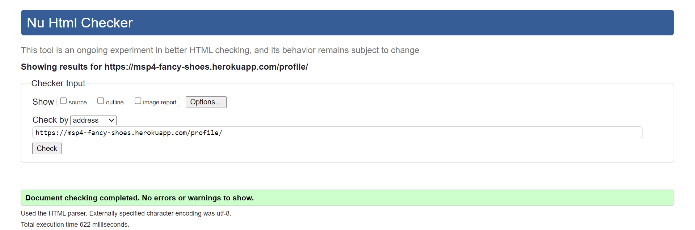

Fancy Shoes Project Testing Details
===


[Main README.md file](https://github.com/Puksrevolution/milestone-project-4/blob/main/README.md)

[View the live project here.](https://msp4-fancy-shoes.herokuapp.com/)

---
## Table of Contents ##

- [Automated Testing](#automated-testing)
  - [Test Driven Development (TDD)](#test-driven-development-(tdd))
  - [Validation Services](#validation-services)
- [Manual Testing](#manual-testing)
  - [Unit Testing](#unit-testing)
  - [Testing undertaken on desktop](#testing-undertaken-on-desktop)
  - [Testing undertaken on phone devices](#testing-undertaken-on-phone-devices)
- [Bugs](#bugs)
---


Automated Testing
===

### **Test Driven Development (TDD)**

[Django unittest documentation](https://docs.djangoproject.com/en/3.2/topics/testing/overview/)

Using Django's standard unit test library module `unittest`, a class based approach was used to build tests for each app's functionality.

For each app in the project, where applicable, the following files were tested:
  - `views.py` tested by `test_views.py`
  - `models.py` tested by `test_models.py`
  - `forms.py` tested by `test_forms.py`


### **Validation Services**

The following **validation services** and **linters** were used to check the validity of the website code.

- [W3C CSS Validation Service](https://jigsaw.w3.org/css-validator/)
  - This validator checks the validity of cascading style sheets (css) and (X)HTML documents with style sheets.
  - All css files passed the validation service, after a small value error fix.

    

- [W3C Markup Validator](https://validator.w3.org/)
  - This validator checks the markup validity of Web documents in HTML, XHTML, SMIL, MathML, etc.

  - Home:

    

  - Products:

    

  - Product Page:

    

  - Add Product:

    

  - Edit Product:

    

  - Cart:

    

  - Checkout:

    

  - Profile:

    

  - Register:

    

  - Login:

    

- [Flake8 Python Lintier](http://pep8online.com/checkresult)
  - This extension linter checks the validity of Python code against the PEP8 requirements. The code is reviewed and refactored during development.

- [Chrome DevTools Lighthouse](https://developers.google.com/web/tools/lighthouse)
  - An open-source automated tool for improving webpages by running audits for performance, accessibility, progressive web apps, SEO etc.

  - ### **Desktop Performance Report**

          
  

  - ### **Mobile Performance Report**

    

[Back to Table of contents](#table-of-contents)

---


Manual Testing
===

### **Unit Testing**
[Unit Testing document](https://github.com/Puksrevolution/milestone-project-4/blob/main/Documentation/testing/unit_test_case_log.pdf) containing:
- Unit Test scope,
- The test cases,
- The pass / fail record for each test case.

### **Testing undertaken on desktop**
- Hardware:
  - ThinkPad E14 Gen Laptop 
  - 14,0" FHD (1920 × 1080) TN antireflex, 220 cd/m²    
- Tested Operating Systems:
  - Windows 10 Pro 64
- Tested Browsers:
  - Chrome
  - Firefox
  - Edge
  - Opera    

### **Testing undertaken on phone devices**
- Hardware:
  - Galaxy A20e 5.80"
- Tested Operating Systems:    
  - Android 10
- Tested Browsers:
  - Samsung
  - Chrome
  - Firefox

[Back to Table of contents](#table-of-contents)

---


Bugs
===


- Easy fix: Change value: none to value: transparent

- Didn't manage the prefill function to work for first and last name

- Issiue with sending email solved with an easy change of the DEVELOPMENT value: True to the value: False

- Delet Review function didn't worked correctly, neede to be rewritten.

- Migrations to Heroku didn't uploaded, issiue contacts and reviews not existed in Heroku/Django-Admin Dashboard, needed to be done manually in terminal
```
heroku run python3 manage.py migrate -a msp4-fancy-shoes
```

- Reviews didn't displayed on webpage, missing Reviews in reviews/views.py

- Disable function on Reviews Star selector didn't worked, delete not needed code.

[Back to Table of contents](#table-of-contents)